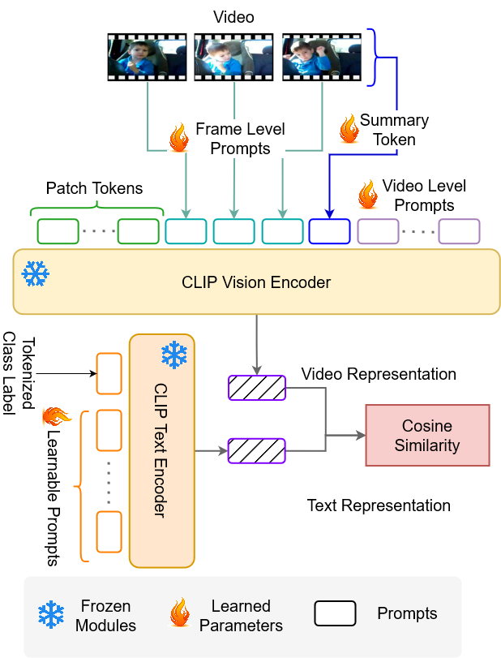

# Official repository for Vita-CLIP: Video and text adaptive CLIP via Multimodal Prompting [CVPR 2023]

[Syed Talal Wasim](https://talalwasim.github.io),
[Muzammal Naseer](https://muzammal-naseer.netlify.app/),
[Salman Khan](https://salman-h-khan.github.io),
[Fahad Shahbaz Khan](https://sites.google.com/view/fahadkhans/home),
[Mubarak Shah](https://www.crcv.ucf.edu/person/mubarak-shah/)

**[Paper Link](https://arxiv.org/abs/2304.03307)** 

> **Abstract:**
>*Adopting contrastive image-text pretrained models like CLIP towards video classification has gained attention due to its cost-effectiveness and competitive performance. However, recent works in this area face a trade-off. Finetuning the pretrained model to achieve strong supervised performance results in low zero-shot generalization. Similarly, freezing the backbone to retain zero-shot capability causes significant drop in supervised accuracy. Because of this, recent works in literature typically train separate models for supervised and zero-shot action recognition.
In this work, we propose a multimodal prompt learning scheme that works to balance the supervised and zero-shot performance under a single **unified** training. Our prompting approach on the vision side caters for three aspects: 1) Global **video-level** prompts to model the data distribution; 2) Local **frame-level** prompts to provide per-frame discriminative conditioning; and 3) a **summary prompt** to extract a condensed video representation. Additionally, we define a prompting scheme on the text side to augment the textual context.
Through this prompting scheme, we can achieve state-of-the-art zero-shot performance on Kinetics-600, HMDB51 and UCF101 while remaining competitive in the supervised setting. By keeping the pretrained backbone frozen, we optimize a much lower number of parameters and retain the existing general representation which helps achieve the strong zero-shot performance.*

  

